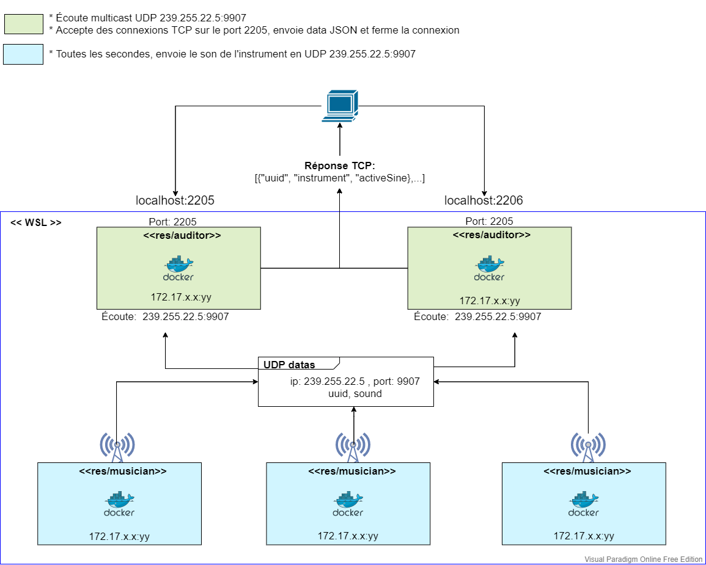

# Teaching-HEIGVD-RES-2020-Labo-Orchestra

## Admin

* **You can work in groups of 2 students**.
* It is up to you if you want to fork this repo, or if you prefer to work in a private repo. However, you have to **use exactly the same directory structure for the validation procedure to work**. 
* We expect that you will have more issues and questions than with other labs (because we have a left some questions open on purpose). Please ask your questions on Telegram / Teams, so that everyone in the class can benefit from the discussion.

## Objectives

This lab has 4 objectives:

* The first objective is to **design and implement a simple application protocol on top of UDP**. It will be very similar to the protocol presented during the lecture (where thermometers were publishing temperature events in a multicast group and where a station was listening for these events).

* The second objective is to get familiar with several tools from **the JavaScript ecosystem**. You will implement two simple **Node.js** applications. You will also have to search for and use a couple of **npm modules** (i.e. third-party libraries).

* The third objective is to continue practicing with **Docker**. You will have to create 2 Docker images (they will be very similar to the images presented in class). You will then have to run multiple containers based on these images.

* Last but not least, the fourth objective is to **work with a bit less upfront guidance**, as compared with previous labs. This time, we do not provide a complete webcast to get you started, because we want you to search for information (this is a very important skill that we will increasingly train). Don't worry, we have prepared a fairly detailed list of tasks that will put you on the right track. If you feel a bit overwhelmed at the beginning, make sure to read this document carefully and to find answers to the questions asked in the tables. You will see that the whole thing will become more and more approachable.


## Requirements

In this lab, you will **write 2 small NodeJS applications** and **package them in Docker images**:

* the first app, **Musician**, simulates someone who plays an instrument in an orchestra. When the app is started, it is assigned an instrument (piano, flute, etc.). As long as it is running, every second it will emit a sound (well... simulate the emission of a sound: we are talking about a communication protocol). Of course, the sound depends on the instrument.

* the second app, **Auditor**, simulates someone who listens to the orchestra. This application has two responsibilities. Firstly, it must listen to Musicians and keep track of **active** musicians. A musician is active if it has played a sound during the last 5 seconds. Secondly, it must make this information available to you. Concretely, this means that it should implement a very simple TCP-based protocol.


### Instruments and sounds

The following table gives you the mapping between instruments and sounds. Please **use exactly the same string values** in your code, so that validation procedures can work.

| Instrument | Sound         |
|------------|---------------|
| `piano`    | `ti-ta-ti`    |
| `trumpet`  | `pouet`       |
| `flute`    | `trulu`       |
| `violin`   | `gzi-gzi`     |
| `drum`     | `boum-boum`   |

### TCP-based protocol to be implemented by the Auditor application

* The auditor should include a TCP server and accept connection requests on port 2205.
* After accepting a connection request, the auditor must send a JSON payload containing the list of <u>active</u> musicians, with the following format (it can be a single line, without indentation):

```
[
  {
  	"uuid" : "aa7d8cb3-a15f-4f06-a0eb-b8feb6244a60",
  	"instrument" : "piano",
  	"activeSince" : "2016-04-27T05:20:50.731Z"
  },
  {
  	"uuid" : "06dbcbeb-c4c8-49ed-ac2a-cd8716cbf2d3",
  	"instrument" : "flute",
  	"activeSince" : "2016-04-27T05:39:03.211Z"
  }
]
```

### What you should be able to do at the end of the lab


You should be able to start an **Auditor** container with the following command:

```
$ docker run -d -p 2205:2205 res/auditor
```

You should be able to connect to your **Auditor** container over TCP and see that there is no active musician.

```
$ telnet IP_ADDRESS_THAT_DEPENDS_ON_YOUR_SETUP 2205
[]
```

You should then be able to start a first **Musician** container with the following command:

```
$ docker run -d res/musician piano
```

After this, you should be able to verify two points. Firstly, if you connect to the TCP interface of your **Auditor** container, you should see that there is now one active musician (you should receive a JSON array with a single element). Secondly, you should be able to use `tcpdump` to monitor the UDP datagrams generated by the **Musician** container.

You should then be able to kill the **Musician** container, wait 5 seconds and connect to the TCP interface of the **Auditor** container. You should see that there is now no active musician (empty array).

You should then be able to start several **Musician** containers with the following commands:

```
$ docker run -d res/musician piano
$ docker run -d res/musician flute
$ docker run -d res/musician flute
$ docker run -d res/musician drum
```
When you connect to the TCP interface of the **Auditor**, you should receive an array of musicians that corresponds to your commands. You should also use `tcpdump` to monitor the UDP trafic in your system.


## Task 1: design the application architecture and protocols

| #  | Topic |
| --- | --- |
|Question | How can we represent the system in an **architecture diagram**, which gives information both about the Docker containers, the communication protocols and the commands? |
| |  |
|Question | Who is going to **send UDP datagrams** and **when**? |
| | Musicians containers are going to send UDP datagrams every second. |
|Question | Who is going to **listen for UDP datagrams** and what should happen when a datagram is received? |
| | Every auditor containers are going to recieve UDP datagrams. When they recieve a datagram, they will update a table that keeps track of alive musicians (that have send data less than 5 seconds ago). |
|Question | What **payload** should we put in the UDP datagrams? |
| | Musician uuid and his instrument sound. |
|Question | What **data structures** do we need in the UDP sender and receiver? When will we update these data structures? When will we query these data structures? |
| | When need two maps:</br><b>In musicians</b>, map < instrument, sound > to know what sound to emit. This is querried only when the musician is created.</br><b>In auditors</b>, map < sound, instrument > to know what instrument made the sound he recieved. This is querried every time a datagram UDP is recieved.</br>These two are never updated and they are a reflexion of each other.</br><br>We need one last maps on auditor side:</br>map < uuid, instrument, time of first activity, time of last activity ></br>The map will be updated everytime a musician sends a datagram. The corresponding musician last activity will be updated to the current date.</br>To check if a musician need to be removed, the auditor wait for a TCP request, then for all musicians :</br> * if his last time of activity is greater than 5 seconds ago, the musician will be removed </br> * else he will be added in the JSON payload</br>The time of last activity of every musicians will not be added in the JSON payload of the response.


## Task 2: implement a "musician" Node.js application

| #  | Topic |
| ---  | --- |
|Question | In a JavaScript program, if we have an object, how can we **serialize it in JSON**? |
| | We can do it with [<i>stringify</i>](http://www.tutorialspark.com/javascript/JavaScript_JSON_Parsing_Serialization.php#:~:text=Javascript%20JSON%3A%20Objects&text=stringify()%20%3A%20To%20serialize%20JavaScript,into%20a%20native%20JavaScript%20value.&text=The%20JSON%20string%20can%20be,create%20an%20appropriate%20JavaScript%20value.) method.  |
|Question | What is **npm**?  |
| | [<i>Npm</i>](https://www.npmjs.com/) is the node package manager, a registry and a CLI.  |
|Question | What is the `npm install` command and what is the purpose of the `--save` flag?  |
| | It installs a package and his dependencies. [`--save`](https://www.geeksforgeeks.org/what-is-the-meaning-of-save-for-npm-install/#:~:text=If%20you%20are%20using%20a,json%20file.) was used to install a package into the dependency list in package.json file. This flag is not requiered anymore since npm 5.0.0  |
|Question | How can we use the `https://www.npmjs.com/` web site?  |
| | This quote found on the npm web site sums it up `Use the website to discover packages, set up profiles, and manage other aspects of your npm experience. For example, you can set up organizations to manage access to public or private packages.` |
|Question | In JavaScript, how can we **generate a UUID** compliant with RFC4122? |
| | The [package rfc4122](https://www.npmjs.com/package/rfc4122) does it. It has implement all 5 versions of rfc4122. </br>In this lab, we have chosen to use the version 4 (f for faster) of rfc4122. Its generates UUID randomly which seems appropriate in our context and simple to implement. Be aware that there is a small risk of collision.  |
|Question | In Node.js, how can we execute a function on a **periodic** basis? |
| | The function [setInterval](https://www.w3schools.com/jsref/met_win_setinterval.asp) does it.  |
|Question | In Node.js, how can we **emit UDP datagrams**? |
| | Using the dgram package. We first create a socket with `dgram.createSocket('udp4')` and then, we emit UDP datagrams with `send` method from our socket.  |
|Question | In Node.js, how can we **access the command line arguments**? |
| | [Command line arguments](https://nodejs.org/en/knowledge/command-line/how-to-parse-command-line-arguments/) are stored in an array `process.argv`.  |


## Task 3: package the "musician" app in a Docker image

| #  | Topic |
| ---  | --- |
|Question | How do we **define and build our own Docker image**?|
| | We use a Dockerfile. Its contains the instructions to build the image.<br> Then, we use the command [`docker build`](https://docs.docker.com/engine/reference/commandline/build/).  |
|Question | How can we use the `ENTRYPOINT` statement in our Dockerfile?  |
| | This statement is used to indicate to our container what he has to run/execute on start. </br> In our case, we use two arguments: `node` and `"/opt/app/musician.js"`. </br> Basically it means: run "node /opt/app/musician.js" on start up. In other words, run our application. |
|Question | After building our Docker image, how do we use it to **run containers**?  |
| | We use the `docker run` command.</br> `docker run <name of docker image> <instrument name>`</br> The instrument name will be appended to entrypoint execution.|
|Question | How do we get the list of all **running containers**?  |
| | We get such a list with `docker ps`. |
|Question | How do we **stop/kill** one running container?  |
| | We execute `docker kill <container name>`.  We can pass as argument `$(docker ps -qa)` to kill all running containers. |
|Question | How can we check that our running containers are effectively sending UDP datagrams?  |
| | We can use Wireshark or tcpdump to scan the docker network interface.  |


## Task 4: implement an "auditor" Node.js application

| #  | Topic |
| ---  | ---  |
|Question | With Node.js, how can we listen for UDP datagrams in a multicast group? |
| | First, we create a socket with `createSocket('udp4')`.<br> Then, with `bind`, we bind the socket to a port and we execute a lambda that makes `addMemberShip` to join a multicast group . |
|Question | How can we use the `Map` built-in object introduced in ECMAScript 6 to implement a **dictionary**?  |
| | In a first approach, we are building two maps: one that maps sound to instrument and the other that maps </br>instrument to sound. Thoses maps are made out of the two arrays that are defined in `protocole.js` from musician and auditor. Secondly, we create a last map that matches uuid to last message datetime and first message datetime on auditor side.</br> We use it like this `new Map([iterable])`.|
|Question | How can we use the `Moment.js` npm module to help us with **date manipulations** and formatting?  |
| | Moment.js will be creating datetime objects.</br>We can get the current date with `moment()`.</br> We get a bunch of functions to  mutate datetime object `substract or add`</br>We used method `diff` to compare 2 moments. The return value is in milliseconds, so we check if the value is greater than 5000 to remove a musician.</br>Finally, we can format datetime with `format`. In order to match the example, we do not need arguments.|
|Question | When and how do we **get rid of inactive players**?  |
| | We get rid of inactive players when an auditor gets a TCP connection. Before packaging the list, he will check each entry of the  map (uuid, musician) and remove each musician that has not sent any noise since 5 seconds.|
|Question | How do I implement a **simple TCP server** in Node.js?  |
| | In order to create a simple TCP server, we can use the package  `net`. Then, we spawn our serveur `net.createServer` and we define a callback function `listen` specifying a port and a host. |


## Task 5: package the "auditor" app in a Docker image

| #  | Topic |
| ---  | --- |
|Question | How do we validate that the whole system works, once we have built our Docker image? |
| | We execute some tests by launching the script `validate.sh`. It will create some musicians and auditors. Then, it checks if the auditors can get queried by TCP. Finally, it checks if auditors are getting updated when an auditor dies. |


## Constraints

Please be careful to adhere to the specifications in this document, and in particular

* the Docker image names
* the names of instruments and their sounds
* the TCP PORT number

Also, we have prepared two directories, where you should place your two `Dockerfile` with their dependent files.

Have a look at the `validate.sh` script located in the top-level directory. This script automates part of the validation process for your implementation (it will gradually be expanded with additional operations and assertions). As soon as you start creating your Docker images (i.e. creating your Dockerfiles), you should try to run it.
